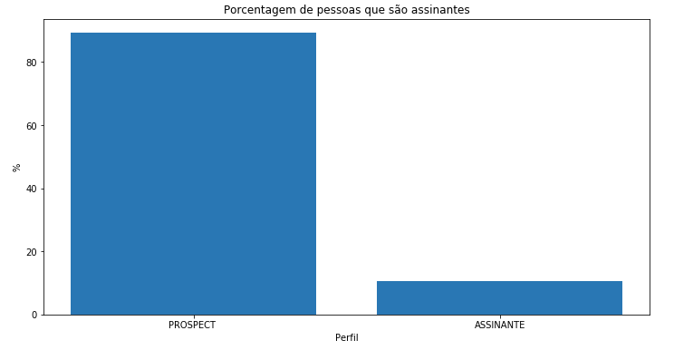

# Case Aquisição
Filippo Petroli

2 de agosto de 2019

## Proposta

### Histórico do assunto

Pode-se dizer que otimizar processos é um objetivo de qualquer empresa. Seja a empresa de qual ramo for, ter seu desempenho maximizado com a menor quantidade de recursos pode ser um tiro certeiro no desenvolvimento do negócio.

Em Setembro de 2017, com objetivo de acelerar a estratégia digital do Grupo RBS, foi criado o GaúchaZH, um jornal digital. Em 2018 foi registrado um crescimento de mais de 40% da carteira digital e recordes de audiência. A estratégia de aceleração no Grupo RBS é data driven e está em constante crescimento da maturidade analítica, ampliando a sua capacidade de predição e prescrição. Eles buscam cada vez mais entender o comportamento dos usuários para entregar melhores produtos e ampliar a carteira de assinantes. Em 2019, o objetivo é ampliar ainda mais a capacidade de aquisição de novos assinantes através de um modelo de predição.

### Descrição do problema

O problema a ser resolvido para ampliar a capacidade de aquisição de novos clientes é entender o comportamento dos usuários da plataforma. Desta forma, pode-se então utilizar um algoritmo de machine learning para prever e rotular os usuários como possíveis assinantes ou não. Com isto, é possível saber quais clientes fazem valer o investimento de uma ligação ou um e-mail mais direcionado para a conversão, por exemplo.

### Conjuntos de dados e entradas

Para a solução deste problema, o Grupo RBS forneceu duas bases de dados com um conjunto de pessoas que assinaram e não assinaram a plataforma em um determinado mês.

As bases fornecidas são a Planilha_1.csv com dados de uso da plataforma e a Planilha_2.csv com dados demográficos.

Referente a Planilha_1.csv, as informações de uso são dos 60 dias para trás do mês para prospects (pessoas não assinantes) e 60 dias para trás relativos à data da compra para assinantes. A base conta com 5600 observações.
As suas variávies são:
- ID – identificação única de indivíduo;
- QT_TOTAL_HIT_PAYWALL – quantidade de Hit Paywall (hit paywall é quando a pessoa tenta ler uma matéria e não é assinante, recebe um pop-up para assinar);
- DIASNAVEGADOS – quantidade de dias navegados não importando a origem (Aplicativo ou Site);
- VISITAS_CAPA – quantidade de visitas à capa de GaúchaZH;
- NOTICIASLIDAS – quantidade de notícias lidas total;
- USOU_APP – se usou ou não usou algum aplicativo de GaúchaZH.

A Planilha_2.csv, com os dados demográficos, também conta com 5600 observações.
As suas variáveis são:
- ID – identificação única de indivíduo;
- Perfil - Define se o indivíduo é ou não assinante.
- Gênero -  F: Feminino, M: Masculino, I: Indefinido;
- PES_NASCIMENTO_DATA - Data de nascimento “dia.mes.ano”. Obs.: considera-se que a pessoa precisa ter mais de 18 anos para se tornar assinante e uma margem de até 100 anos para considerar que a pessoa ainda está viva;
- ATR_PF_GEO_RENDA_FAM - Renda em Salários mínimos por medida Geográfica, ‘SM’ significa salários mínimos.

### Descrição da solução

Como solução deste problema, será utilizado um algoritmo de machine learning apropriado para identificação dos possíveis assinantes e não assinantes.
Como etapas de solução, propõe-se as seguintes atividades:
- Avaliação e limpeza de dados
- Breve análise exploratória
- Pré-processamento
- Modelagem
- Tuning

Com estas etapas definidas e executadas, acredita-se que será possível gerar a predição de assinantes.

### Modelo de referência (benchmark)

Como referência, será utilizado um pipeline de três algortimos: Random Forest, Gradient Boosting e KNeighbors. Os três modelos serão treinados em sua configuração inicial para serem avaliados de acordo com a métrica de avaliação descrita no tópico a seguir. O algoritmo que se sair melhor será eleito para servir como referência e será aprimorado posteriormente para ser a versão final do projeto.

### Métricas de avaliação

Para avaliar o desempenho do modelo e do benchmark será usado o f-score.
O f-score é uma média entre precisão e recall. Ele é bom quando a base de dados é desproporcional, que é o caso desta base.

Abaixo está o gráfico que comprova a diferença de quantidade entre assinantes e não assinantes no dataset.

### Arquitetura do projeto

Conforme mencionado na descrição da solução, o projeto seguirá as seguintes etapas para a obtenção da resolução:

- **Avaliação e limpeza de dados**

Nesta etapa inicial serão analisadas de forma programática e visual as bases de dados fornecidas com o intuito de ter uma base sólida com dados consolidados para uma modelagem mais precisa. Após a identificação dos problemas, todos serão corrigidos e testados para verificar a efetividade da resolução.

- **Breve análise exploratória**

Ao terminar a limpeza de dados, fará-se uma breve análise exploratória para entender melhor o dataset fornecido.
Para isto, serão levantadas as seguintes questões:
    - Qual a porcentagem de pessoas que utilizam o app na amostra?
    - Qual a porcentagem de pessoas que são assinantes?
    - Como é a distribuição de renda dos assinantes da amostra?

- **Pré-processamento**

Nesta parte, antes de iniciar a construção do modelo em si, pode ser necessário aplicar algumas transformações nos dados para o modelo ser mais preciso.

- **Modelagem**

Em seguida, a base estará pronta para a criação de um modelo, criará-se então um pipeline de treinamento e predição para poder testar os dados em diferentes algoritmos.
Serão testados os seguintes algoritmos em suas configurações padrão:
    - Random Forest
    - Gradient Boosting
    - KNeighbors

Logo após estas modelagens iniciais, o algoritmo que performar melhor segundo o f-score será o escolhido para a etapa de tuning.

- **Tuning**

Após a modelagem, será feito um tuning do modelo. Ou seja, fazer alguns ajustes para encontrar um modelo melhor ainda.

***

Seguindo estas etapas, espera-se ao final ter resolvido o problema e conseguir enfim encontrar uma forma de predição para assinantes e não assinantes.

